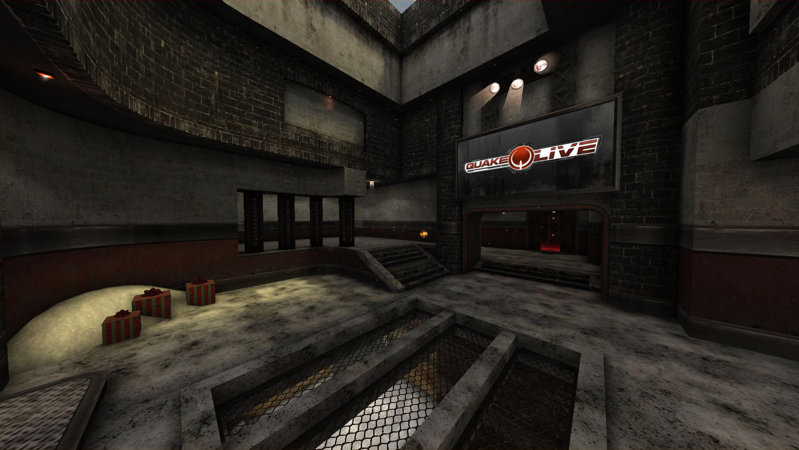
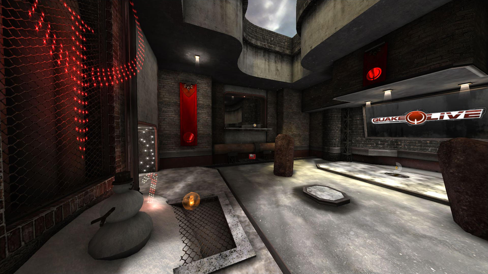
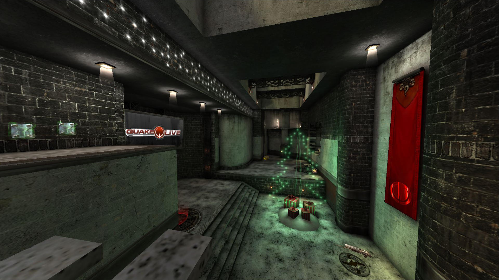
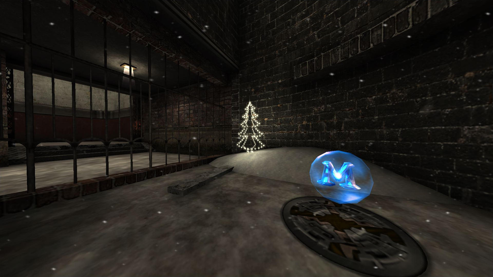
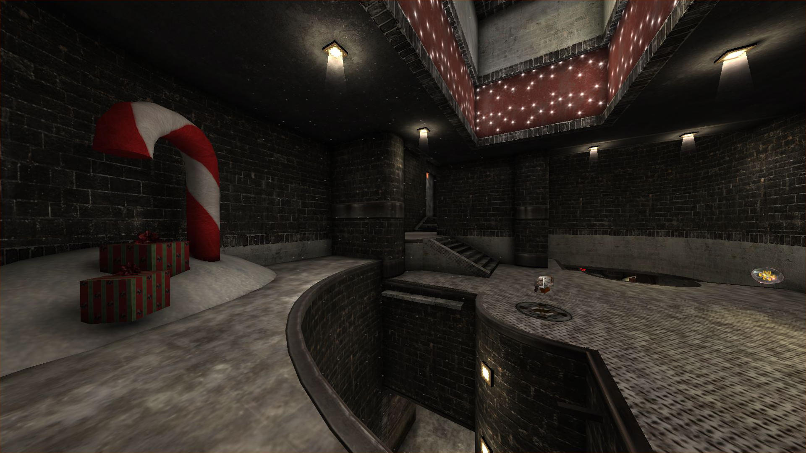

# Christmaspurge

This repository contains a "winter remake" of the quake 3/live map Purgatory (`qzdm2k`) by Gary 'akm' Turner and Mike 'Yellack' Schreiber. It heavly borrows textures made by Scorch_ and the author(s) of Winter's Edge (q2dm1).

## Screenshots
 
 
 

## Content

The repository contains the following .map (uncompiled level) files for editing via [GtkRadiant](https://icculus.org/gtkradiant/)/[NetRadiant](https://netradiant.gitlab.io/).

* Decompiled purgatory map (`purgatory_decompiled.map`). You'll lose all lightmap information when decompiling a bsp map, some textures will be missing and/or incorrectly oriented.
* Decompiled map with restored lights and textures (`purgatory_restored.map`).
* Christmaspurge map (purgatory with winter textures) (`christmaspurge.map`)

Additionally, the `christmaspurge` folder contains all files needed to create a .pk3 file of the map. These are:

* compiled map (`christmaspurge.bsp`)
* bot navigation file (`christmaspurge.aas`)
* textures
* shaders
* levelshot

The .pk3 was compiled using the following options using netradiant:

    [q3map2] -meta "[MapFile]"
    [q3map2] -vis "[MapFile]"
    [q3map2] -light -bounce 8 -fastbounce -dark -dirtdepth 32 -dirtscale 3 -dirty -patchshadows -samples 3 -scale 0.8 -shade -cpma "[MapFile]"

## Credits

* Gary 'akm' Turner and Mike 'Yellack' Schreiber for creating qzdm2k.
* Scorch_ for textures and shaders.
